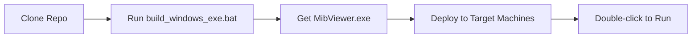

# MIB EELS Viewer with 4D STEM Support

**PyQtGraph-based GUI for analyzing MIB EELS and 4D STEM datasets with hardware-accelerated graphics and virtual detector capabilities.**


## 🎯 Quick Start for Windows Users

### Building the Standalone Executable

1. **Clone this repository:**
   ```cmd
   git clone [your-repo-url]
   cd mib-viewer
   ```

2. **One-click build:**
   ```cmd
   build_windows_exe.bat
   ```

3. **Find your executable:**
   - Location: `dist\MibViewer.exe` (80-120 MB)
   - **Deploy anywhere** - no Python or dependencies required!

### Alternative: Manual Build
```cmd
pip install PyQt5 pyqtgraph numpy matplotlib h5py emdfile tqdm pyinstaller
python build_exe.py
```

---

## 📋 What's Included in This Repository

### ✅ **Source Code**
- `src/mib_viewer/` - Main application code
- `standalone_main.py` - PyInstaller entry point

### ✅ **Build System**
- `build_windows_exe.bat` - One-click Windows build
- `build_exe.py` - Multi-strategy build script with fallbacks
- `MibViewer.spec` - PyInstaller configuration
- `pyproject.toml` - Dependencies (Windows-compatible versions)
- `requirements.txt` - Fallback pip requirements

### ✅ **Documentation**
- `WINDOWS_BUILD.md` - Complete build instructions
- `WINDOWS_INSTALL.md` - User guide for running the .exe
- `CONVERSATION_SUMMARY.md` - Development history

### ✅ **Testing**
- `test_windows_setup.bat` - Verify Windows environment

---

## 🚫 What's NOT Included (Intentionally)

### **Platform-Specific Files**
- `uv.lock` - ❌ Causes PyQt5 wheel issues on Windows
- `.venv/` - ❌ Platform-specific virtual environments
- `build/`, `dist/` - ❌ Build artifacts

### **Large Data Files** 
- `*.mib`, `*.ndata1` - ❌ Example datasets (too large for git)
- Use your own data files for testing

---

## 🔧 Why This Approach?

### **Fresh Environment Resolution**
Windows users get clean dependency resolution without Linux-specific lock file conflicts.

### **No uv.lock Issues**
The problematic `uv.lock` (containing PyQt5-Qt5 v5.15.17 without Windows wheels) is excluded. Windows users resolve dependencies fresh for their platform.

### **Standalone Deployment**
Build once → deploy everywhere as single .exe file.

---

## ✨ Features

### **EELS Analysis**
- Hardware-accelerated PyQtGraph graphics
- Resizable, rotatable ROI widgets
- Real-time spectrum updates
- Interactive energy range selection

### **4D STEM Analysis** 
- Virtual detector overlays (BF/DF)
- Real-time virtual imaging
- Scan position navigation
- Optimized update timing (300ms delay)

### **Technical**
- Memory-mapped file access
- Automatic scan size detection
- EMD format conversion ready
- Cross-platform compatibility

---

## 📁 File Format Support

- **MIB files**: 4D EELS/STEM datasets
- **ndata files**: 2D contextual images
- **EMD files**: Compressed format (future)

---

## 🛠️ Development Setup

### **Requirements**
- Windows 10+ (64-bit)
- Python 3.10+
- Internet connection (for initial build only)

### **Dependencies**
Automatically installed by build script:
- PyQt5 (GUI framework)
- PyQtGraph (hardware-accelerated graphics)
- NumPy, matplotlib (data processing)
- h5py, emdfile (file formats)
- PyInstaller (executable packaging)

---

## 📞 Support

### **Build Issues**
See `WINDOWS_BUILD.md` for detailed troubleshooting.

### **Usage Questions**
See `WINDOWS_INSTALL.md` for complete user guide.

### **Runtime Problems**
Common issues and solutions in the install guide.

---

## 🔄 Workflow



---

## 📈 Version Info

- **Status**: Alpha testing ready
- **Target**: Electron microscopy acquisition computers
- **Architecture**: PyQtGraph + PyInstaller standalone deployment
- **Performance**: Hardware-accelerated real-time visualization

---

*Designed for the electron microscopy workflow - from acquisition computers to offline analysis stations.*